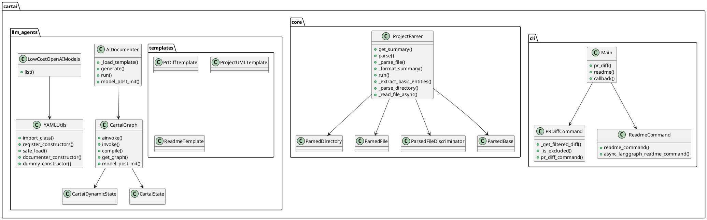

```plantuml
@startuml
package cartai {
    package cli {
        class Main {
            +pr_diff()
            +readme()
            +callback()
        }
        class PRDiffCommand {
            +_get_filtered_diff()
            +_is_excluded()
            +pr_diff_command()
        }
        class ReadmeCommand {
            +readme_command()
            +async_langgraph_readme_command()
        }
    }

    package core {
        class ProjectParser {
            +get_summary()
            +parse()
            +_parse_file()
            +_format_summary()
            +run()
            +_extract_basic_entities()
            +_parse_directory()
            +_read_file_async()
        }
        class ParsedDirectory {}
        class ParsedFile {}
        class ParsedFileDiscriminator {}
        class ParsedBase {}
    }

    package llm_agents {
        class AIDocumenter {
            +_load_template()
            +generate()
            +run()
            +model_post_init()
        }
        class CartaiGraph {
            +ainvoke()
            +invoke()
            +compile()
            +get_graph()
            +model_post_init()
        }
        class CartaiDynamicState {}
        class CartaiState {}
        class LowCostOpenAIModels {
            +list()
        }
        class YAMLUtils {
            +import_class()
            +register_constructors()
            +safe_load()
            +documenter_constructor()
            +dummy_constructor()
        }
    }

    package llm_agents.templates {
        class PrDiffTemplate {}
        class ProjectUMLTemplate {}
        class ReadmeTemplate {}
    }

    Main --> PRDiffCommand
    Main --> ReadmeCommand
    ProjectParser --> ParsedDirectory
    ProjectParser --> ParsedFile
    ProjectParser --> ParsedFileDiscriminator
    ProjectParser --> ParsedBase
    AIDocumenter --> CartaiGraph
    CartaiGraph --> CartaiDynamicState
    CartaiGraph --> CartaiState
    LowCostOpenAIModels --> YAMLUtils
}
@enduml
```
